<h1 align="center">Árvore Rubro-Negra</h1>
<h2 border="none"> Introdução </h2>

Árvores do tipo rubro-negra ou vermelho-preto são árvores binárias de busca balanceadas, que, de maneira simplificada, é uma árvore de busca binária que insere e remove de forma inteligente, para assegurar que a árvore permaneça aproximadamente balanceada.

Essa estrutura foi inventada no ano de 1972 por Rudolf Bayer, um professor emérito de informática na Universidade Técnica de Munique, que nomeou a estrutura de “Árvores binárias B simétricas” e posteriormente foi renomeada em um artigo publicado em 1978 escrito por Leonidas J. Guibas e Robert Sedgewick.

<h3 border="none" align="center"> Complexidade de Tempo em Notação big O </h3>
<table align="center">
    <thead>
        <th> Algoritmo </th>
        <th> Caso médio </th>
        <th> Pior médio </th>
    </thead>
    <tbody>
        <tr>
            <td> Espaço </td>
            <td> O(n) </td>
            <td> O(n) </td>
        </tr>
        <tr>
            <td> Busca </td>
            <td> O(log n) </td>
            <td> O(log n) </td>
        </tr>
        <tr>
            <td> Inserção </td>
            <td> O(log n) </td>
            <td> O(log n) </td>
        </tr>
        <tr>
            <td> Remoção </td>
            <td> O(log n) </td>
            <td> O(log n) </td>
        </tr>
    </tbody>
</table>

<h2>Execução do código</h2>

Códigos compilados e executados em: gcc (Ubuntu 9.3.0-17ubuntu1~20.04) 9.3.0 

Há duas versões para testes:

<ol>
  <li>gcc Main.c -o Main.c</li>
  <li>gcc Testes.c -o Main.c</li>
</ol>

A primeira opção é um teste pré-definido já a segunda é um teste livre para o usuário. Na exibição, a ávore aparecerá deitada, considere cima como direita e baixo com esquerda.

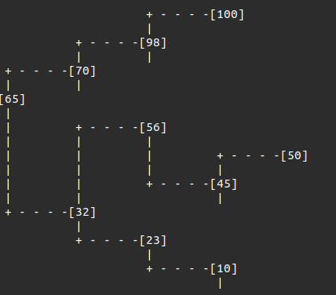

<h2>Estrutura de dado </h2>

A estrutura usada para cada nó de uma árvore rubro-negra é extremamente semelhante a de uma árvore binária simples, a pricipal diferença se dá no acrécimo de uma variável do tipo bolleana para indicar a cor que um determinado nó representa. Nesse caso foi adotado 'false' para a cor vermelha e 'true' para a cor preta.

Dessa forma a estrutura de um nó possui os seguintes atributos: 

<ul>
  <li>Chave</li>
  <li>Cor</li>
  <li>Filho Esquerdo</li>
  <li>Filho Direito</li>
  <li>Pai</li>
</ul>

Caso não exista um pai ou um filho de um nó o atributo do ponteiro correspondente apontará para NULL. Nesse código considera-se que esses valores 'NULL' possuem a cor negra e também são tratados como se fossem ponteiros para as folhas da árvore

~~~C
struct Tree{
    capsule key;
    bool cor; // false = vermelho; true = preto
    Tree *esq;
    Tree *dir;
    Tree *pai;
};
~~~

<h2>Propriedades</h2>

 Uma árvore Rubro-Negra é uma árvore de busca binária que satisfaz as seguintes propriedades Rubro-Negra:

<ol>
  <li>Um nó é vermelho ou é preto</li>
  <li>A raiz é preta</li>
  <li>Toda folha (NULL) é preta</li>
  <li> Se um nó é vermelho então ambos os seus filhos são
pretos</li>
  <li>Para cada nó p, todos os caminhos desde p até as
folhas contêm o mesmo número de nós pretos</li>
</ol>

Essas regras asseguram uma propriedade crítica das árvores rubro-negras: que o caminho mais longo da raiz a qualquer folha não seja mais do que duas vezes o caminho mais curto da raiz a qualquer outra folha naquela árvore. O resultado é que a árvore é aproximadamente balanceada. 

Exemplo de árvore Rubro-Negra:

  

<h2>Rotações</h2>

A árvore Rubro-Negro é um sistema muito delicado, que pode ser facilmente desbalanceado
a partir de operações de inserção e remoção por exemplo. Para corrigir isso é utilizado um esuqema de rotações.

Existem 4 Tipos de rotação e são elas:

<h4>Rotação simples a direita</h4>
<ul>
  <li>Seja X o pai de T</li>
  <li>Torne o filho à direita de T o filho à esquerda de X.</li>
  <li>Torne X o filho à direita de T</li>
</ul>

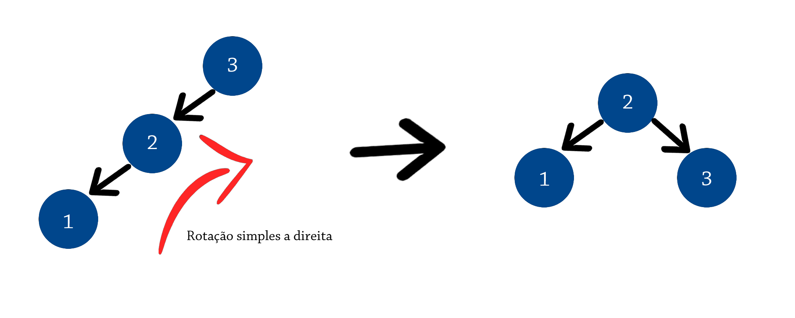

Código utilizado:

~~~C
void RSD(Tree **t){
    Tree *no = (*t);
    Tree *aux = no->pai;
    Tree *vo = avo(no);
    if(no->pai->esq == no){
        if( avo(no) != NULL){
            Tree *sub = (Tree *)malloc(sizeof(Tree));
            vo->esq = no;
            no->pai = vo;
            sub->pai = no;
            sub->dado = aux->dado;
            sub->esq = no->dir;
            sub->dir = aux->dir;
            no->dir = sub;
            free(aux);
        }else{
            /*Swap*/
                capsule temp;
                temp = aux->dado;
                aux->dado = no->dado;
                no->dado = temp;
            /*Fim Swap*/
            aux->esq = no->esq;
            aux->esq->pai = aux;
            no->esq = no->dir;
            no->dir = aux->dir;
            if(no->dir != NULL)
                no->dir->pai = no;
            aux->dir = no;
        }
    }else if(no->pai->dir == no){
        aux = no->esq;
        no->pai->dir = aux;
        aux->pai = no->pai;
        no->esq = aux->dir;
        aux->dir = no;
        no->pai = aux;
    }
}
~~~

<h4>Rotação simples a esqueda</h4>
<ul>
  <li>Seja X o pai de T</li>
  <li>Torne o filho à esquerda de T o filho à esquerda de X.</li>
  <li>Torne X o filho à esquerda de T</li>
</ul>

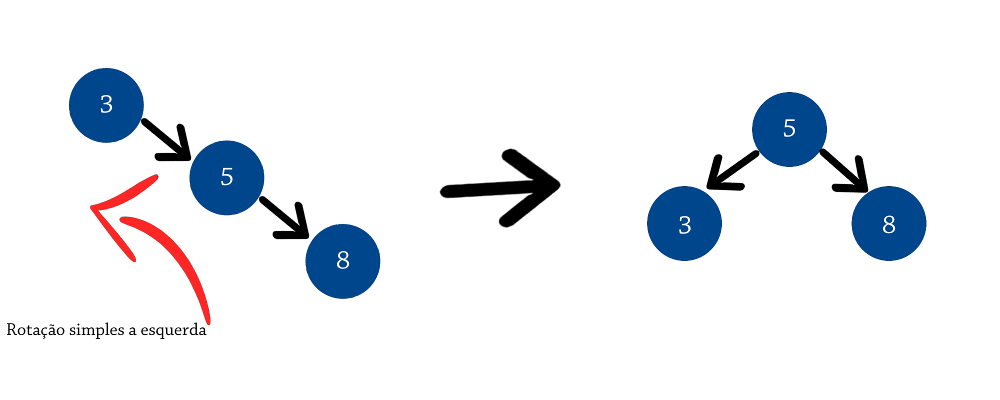

Código Utilizado: 

~~~C
void RSE(Tree **t){
    Tree *no = (*t);
    Tree *aux = no->pai;
    Tree *vo = avo(no);
    if(no->pai->dir == no){
        if( vo != NULL){
            Tree *sub = (Tree *)malloc(sizeof(Tree));
            vo->dir = no;
            no->pai = vo;
            sub->pai = no;
            sub->cor = aux->cor;
            sub->dado = aux->dado;
            sub->dir = no->esq;
            sub->esq = aux->esq;
            no->esq = sub;
            free(aux);
        }else{
            /*Swap*/
                capsule temp;
                temp = aux->dado;
                aux->dado = no->dado;
                no->dado = temp;
            /*Fim Swap*/
            aux->dir = no->dir;
            aux->dir->pai = aux;
            no->dir = no->esq;
            no->esq = aux->esq;
            if(no->esq != NULL)
                no->esq->pai = no;
            aux->esq = no;
        }
    }else if(no->pai->esq == no){
        aux = no->dir;
        no->pai->esq = aux;
        aux->pai = no->pai;
        no->dir = aux->esq;
        aux->esq = no;
        no->pai = aux;
    }

}
~~~

<h4>Rotação Dupla a direita</h4>

Pode ser obtida a partir de uma rotação simples a esquerda seguida de uma rotação simples a direita

Código utilizado: 

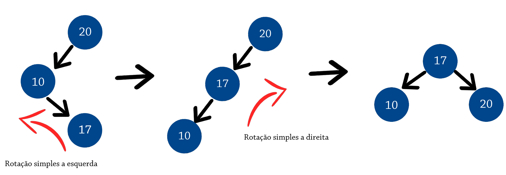

~~~C
void RDD(Tree **t){
    RSE(t);
    RSD(&(*t)->esq);
}
~~~

<h4>Rotação Dupla a esquerda</h4>

Pode ser obtida a partir de uma rotação simples a direita seguida de uma rotação simples a esquerda

Código utilizado: 

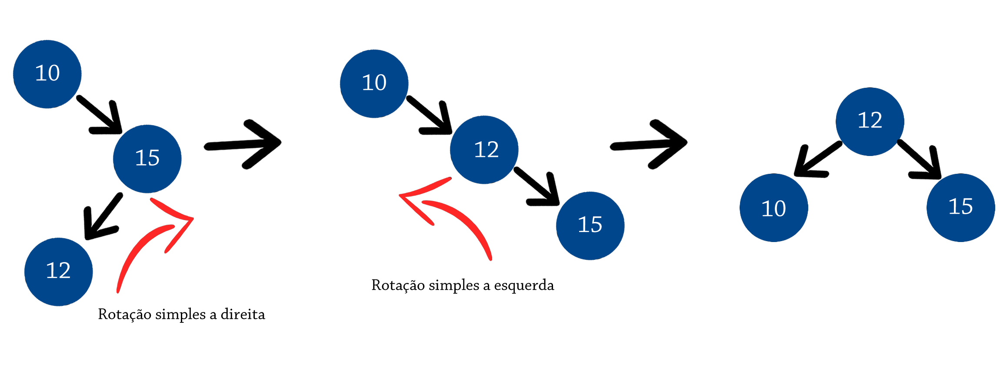

~~~C
void RDE(Tree **t){
    RSD(t);
    RSE(&(*t)->dir);
}
~~~

<h2>Inserções</h2>

Para garantir o balanceamento de uma árvore Rubro-Negra a cada inserção é realizada uma série de verificações com intuito de garantir que suas propriedades sejam sempre verdadeiras. Caso haja algum caso em que as propriedades não são satisfeitas será necessário realizar uma série de rotações e tratamento de cores. Sempre que um elemento é inserido em uma árvore sua cor será vermelha, caso o nó seja raiz sua cor será imediatamente trocada por preta para satisfazer a propriedade 2. Caso o nó inserido não seja o nó raiz deve-se verificar a propriedade 4.

Para facilitar o processo de busca por 'parentes' do nó, utilizamos as seguintes funções para isso: 

~~~C
Tree* avo(struct Tree *no){
	if ((no != NULL) && (no->pai != NULL))
		return no->pai->pai;
	else
		return NULL;
}

Tree* tio(struct node *no){
	Tree *vo = avo(no);
	if (vo == NULL)
		return NULL; // Não ter avô significa não ter tio
	if (no->pai == vo->esquerda)
		return vo->direita;
	else
		return vo->esquerda;
}
~~~

Para garantir as propriedade da árvores Rubro-Negra as verificações são realizadas em até 5 etapas

<h4>Caso 1</h4>

O nó inserido encontra-se na raiz da árvore. Sua cor será alterada para satisfazer a propriedade 2.

~~~C
void Caso1(Tree **t){
    Tree *no = (*t);
    if(no->pai == NULL)
        no->cor = true;
    else
        Caso2(t);
}
~~~

<h4>Caso 2</h4>

O pai do novo nó P é preto. Neste caso a Propriedade 2 claramente não é invalidada. A Propriedade 4 tampouco é ameaçada pois o novo nó N tem como filhos dois nós-folha pretos, e sendo N vermelho, os caminhos passando por cada um dos seus filhos têm o mesmo número de nós pretos - da mesma forma que os caminhos que passavam pelo nó-folha preto que foi substituído por N. Por fim, neste caso, a árvore continua válida após a inserção, não sendo necessária mais alterações.

~~~C
void Caso2(Tree **t){
    Tree *no = (*t);
    if(no->pai->cor == true)
        return;
    else
        Caso3(t);
}
~~~

<h4>Caso 3</h4>

O novo nó N inserido possui o pai P e o Tio T pintados de vermelho, condição que fere a propriedade 2. Nesse caso pinta-se o pai e o tio e N para preto e seu avô para veremelho. Porém, o avô pode estar violando agora a Propriedade 2 ou 4. Para consertar isso, uma "chamada recursiva" do procedimento de Caso1 é iniciada passando o avô como parâmetro

 ~~~C
 void Caso3(Tree **t){
     Tree *no = (*t);
     Tree *ti = tio(no);
     if( (ti != NULL) && ti->cor == false){
         no->pai->cor = true;
         ti->cor = true;
         Tree *av = avo(no);
         av->cor = false;
         Caso1(&av);
     }else
         Caso4(t);
 }
~~~

<h4>Caso 4</h4>

O pai P é vermelho mas o tio U é preto; além disso, o novo nó N é o filho a esquerda de P, e P o filho a direita do seu pai V. Neste caso, uma rotação a direita que troca os papéis do novo nó N e de seu pai P deve ser realizada. Quando isso acontecer o antigo nó-pai P precisa ser tratado usando o Caso 5 (renomeando N e P) isso porque a Propriedade 4 ainda está sendo violada. Além disso, a rotação faz com que alguns caminhos passem pelo novo nó de forma diferente ao que acontecia antes, mas como os dois nós desta sub-árvore são vermelhos a Propriedade 5 não é violada (pela rotação).

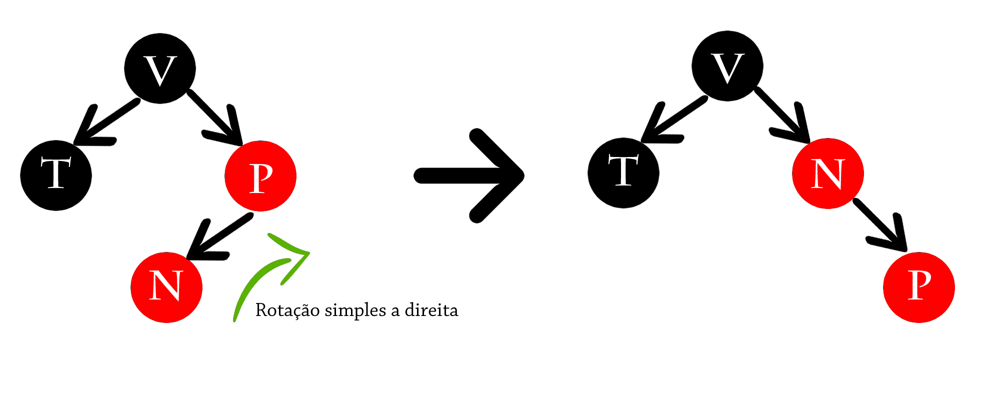

~~~~C
void Caso4(Tree **t){
    Tree *no = (*t);
    Tree *vo = avo(no);

    if( (no->pai->esq == no) && (vo->dir == no->pai) ){ RSD(&no->pai); no = no->dir;}
    if( (no->pai->dir == no) && (vo->esq == no->pai) ){ RSE(&no->pai); no = no->esq;}

    Caso5(&no);
}
~~~~

<h4>Caso 5</h4>

O pai P é vermelho mas o tio U é preto, o novo nó N é o filho direito de seu pai P, e P é o filho direito de seu pai, G. Neste caso, uma rotação a esquerda no pai de P é realizada. O resultado é uma árvore onde o antigo pai P é agora pai tanto do novo nó N quanto do avô de N, G. É sabido que G é preto, já que seu antigo filho P não poderia ser vermelho. Então as cores de P e G são trocadas, e a árvore resultante satisfaz a propriedade 4 (ambos os filhos de cada nó vermelho são pretos). A propriedade 5 (Todos os caminhos de um determinado nó até suas folhas contém o mesmo número de nós pretos) também se mantém satisfeita, já que todos os caminhos até as folhas passam pelo nó G antes, e agora todos passam pelo P. Em cada caso, este é o único nó preto da sub-árvore.

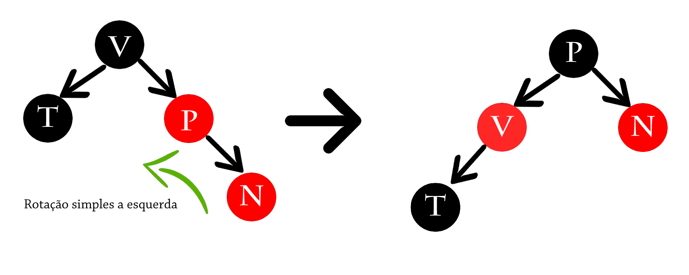

~~~~C
void Caso5(Tree **t){
    Tree *no = (*t);
    Tree *vo = avo(no);
    Tree *pai = no->pai;

    if(vo == NULL ) return;

    if(vo->pai != NULL){
        vo->cor = false;
        pai->cor = true;
    }

    if( (no->pai->dir == no) && (vo->dir == no->pai)) RSE(&no->pai);
    else RSD(&no->pai);

~~~~

<h2>Remoções</h2>

A remoção nas árvores rubro-negras se inicia com uma etapa de busca e remoção como nas árvores binárias de busca convencionais. Então se alguma propriedade vermelho-preta for violada, a árvore deve ser rebalanceada. Dessa forma podemos organizar tudo em um passo a passo:

<ul>
  <li>Encontre o nó v a ser removido</li>
  <li>Remova o nó v da mesma forma que em uma árvore binária de pesquisa</li>
  <li>Ajuste os critérios da árvore rubro-negra</li>
</ul>

No decorrer das remoções podem ocorrer 4 tipos de situações: 

<table align="center">
    <thead>
        <th> Situação </th>
        <th> V </th>
        <th> Sucessor </th>
    </thead>
    <tbody>
        <tr>
            <td> 1 </td>
            <td> Vermelho </td>
            <td> Vermelho </td>
        </tr>
        <tr>
            <td> 2 </td>
            <td> Preto </td>
            <td> Vermelho </td>
        </tr>
        <tr>
            <td> 3 </td>
            <td> Preto </td>
            <td> Preto </td>
        </tr>
        <tr>
            <td> 4 </td>
            <td> Vermelho </td>
            <td> Preto </td>
        </tr>
    </tbody>
</table>

obs:Considere como sucessor o nó mais a esquerda da sub-árvore direira do nó a ser removido

<h3>Situação 1</h3>

seja v o nó a ser removido. Sendo v rubro e x, sucessor de v, também rubro, nada precisará ser feito, pois a árvore Rubro-Negra
continua atendendo a todos os critérios

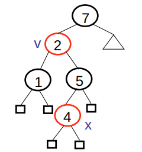
<h3>Situação 2</h3>

v é preto e x é vermelho. Pinte x de negro e pare.

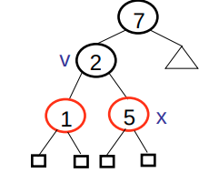
<h3>Situação 3</h3>

v é negro e x é negro.

<h4>Caso 1:</h4>

se x é preto e x tem irmão w vermelho e pai negro.Siga os seguintes passos:

<ul>
  <li>Rotação simples esquerda</li>
  <li>Mude a cor de w para preto</li>
  <li>Mude a cor do pai de x para vermelho</li>
</ul>
  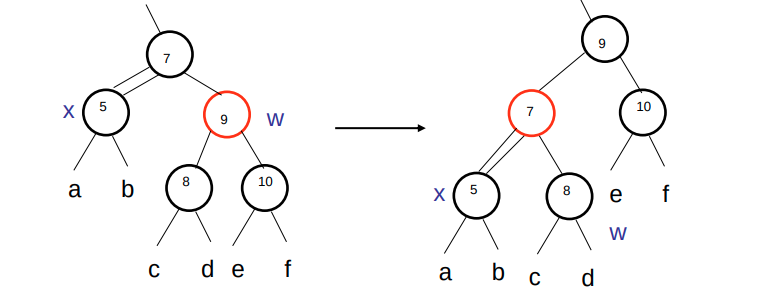
<h4>Caso 2:</h4>

Se x é preto, tem irmão w preto com filhos preto e pai preto. Mude a cor o irmão w para vermelho

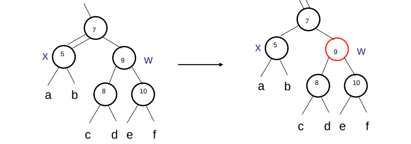
<h4>Caso 3:</h4>

se x é preto, tem irmão w preto com filhos pretos e pai vermelho. Pinte o irmão w de vermelho e o pai de x de preto

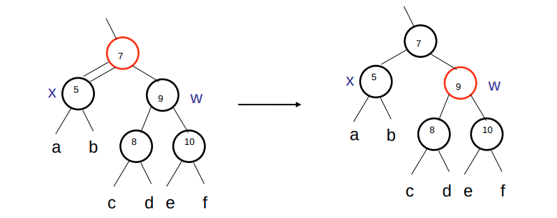
<h4>Caso 4</h4>

Se x é preto, tem irmão w preto, tem
pai de qualquer cor, tem
irmão w com filho esquerdo vermelho e irmão w
com filho direito preto. Siga os passos:
<ul>
  <li>Rotação simples direita em w</li>
  <li>Trocar as cores de w com seu filho esquerdo</li>
</ul>

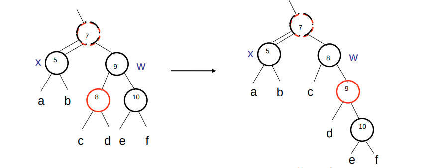
<h4>Caso 5</h4>

Se x é preto, tem irmão w preto, tem
pai de qualquer cor, tem
irmão w com filho esquerdo qualquer cor e
irmão w com filho direito vermelho. Siga os passos:
<ul>
  <li>Rotação simples a esquerda</li>
  <li>Mude a cor do pai para preto</li>
  <li>w igual a cor anterior do pai de x</li>
  <li>Mude a cor do filho direito de w para preto</li>
</ul>

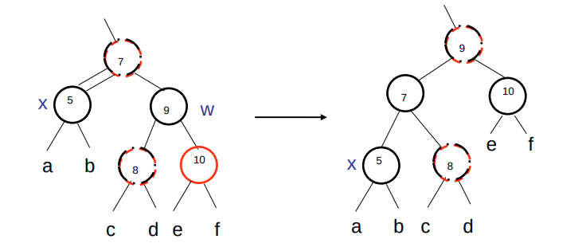

<h3>Situação 4</h3>

v é vermelho e x é preto.
Similar à situação 3. Siga os seguintes passos:
<ul>
  <li>Pinte x de vermelho</li>
  <li>Proceda como na situação 3</li>
</ul>

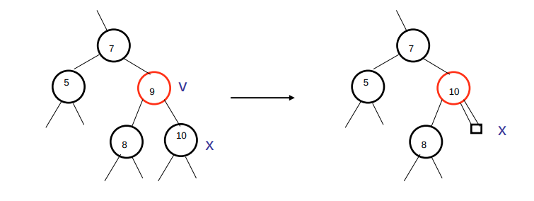
<h1>Referências</h1>

  <ul>
    <li><a href="https://pt.wikipedia.org/wiki/%C3%81rvore_AVL">https://pt.wikipedia.org/wiki/%C3%81rvore_AVL</a></li>
    <li><a href="http://docente.ifrn.edu.br/robinsonalves/disciplinas/estruturas-de-dados/ArvRN.pdf">http://docente.ifrn.edu.br/robinsonalves/disciplinas/estruturas-de-dados/ArvRN.pdf</a></li>
    <li><a href="https://www.ic.unicamp.br/~francesquini/mc202/files/aula16-18.pdf">https://www.ic.unicamp.br/~francesquini/mc202/files/aula16-18.pdf</a></li>
    <li><a href="http://www.facom.ufu.br/~albertini/1sem2013/alg/aulas/aula20-apres.pdf">http://www.facom.ufu.br/~albertini/1sem2013/alg/aulas/aula20-apres.pdf</a></li>
    <li><a href="https://pt.wikipedia.org/wiki/%C3%81rvore_rubro-negra">https://pt.wikipedia.org/wiki/%C3%81rvore_rubro-negra</a></li>
    <li><a href="http://www.ppgia.pucpr.br/~alceu/mestrado/aula1/estruturadados_arvores_parte2.PDF">http://www.ppgia.pucpr.br/~alceu/mestrado/aula1/estruturadados_arvores_parte2.PDF</a></li>
    <li><a href="http://algoritmoconcreta.blogspot.com/2014/05/arvore-rubro-negra.html">http://algoritmoconcreta.blogspot.com/2014/05/arvore-rubro-negra.html</a></li>
  </ul>
