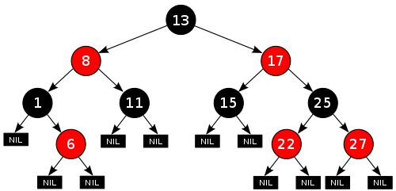
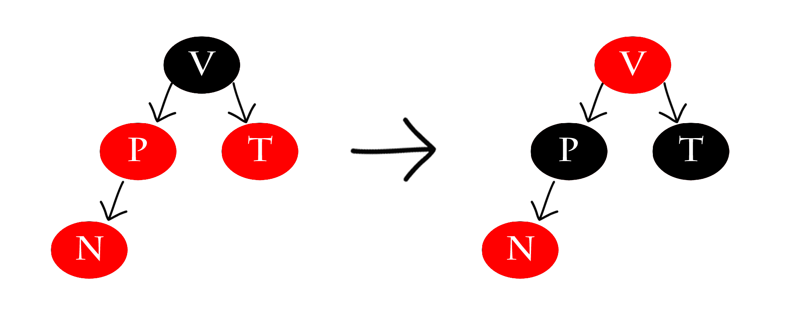

<h1 align="center">Árvore Rubro-Negra</h1>
<h2 border="none"> Intordução </h2>

Árvores do tipo rubro-negra ou vermelho-preto são árvores binárias de busca balanceadas, que, de maneira simplificada, é uma árvore de busca binária que insere e remove de forma inteligente, para assegurar que a árvore permaneça aproximadamente balanceada.

Essa estrutura foi inventada no ano de 1972 por Rudolf Bayer, um professor emérito de informática na Universidade Técnica de Munique, que nomeou a estrutura de “Árvores binárias B simétricas” e posteriormente foi renomeada em um artigo publicado em 1978 escrito por Leonidas J. Guibas e Robert Sedgewick.

<h3 border="none" align="center"> Complexidade de Tempo em Notação big O </h3>
<table align="center">
    <thead>
        <th> Algoritmo </th>
        <th> Caso médio </th>
        <th> Pior médio </th>
    </thead>
    <tbody>
        <tr>
            <td> Espaço </td>
            <td> O(n) </td>
            <td> O(n) </td>
        </tr>
        <tr>
            <td> Busca </td>
            <td> O(log n) </td>
            <td> O(log n) </td>
        </tr>
        <tr>
            <td> Inserção </td>
            <td> O(log n) </td>
            <td> O(log n) </td>
        </tr>
        <tr>
            <td> Remoção </td>
            <td> O(log n) </td>
            <td> O(log n) </td>
        </tr>
    </tbody>
</table>

<h2>Estrutura de dado </h2>

A estrutura usada para cada nó de uma árvore rubro-negra é extremamente semelhante a de uma árvore binária simples, a pricipal diferença se dá no acrécimo de uma variável do tipo bolleana para indicar a cor que um determinado nó representa. Nesse caso foi adotado 'false' para a cor vermelha e 'true' para a cor preta.

Dessa forma a estrutura de um nó possui os seguintes atributos: 

<ul>
  <li>Chave</li>
  <li>Cor</li>
  <li>Filho Esquerdo</li>
  <li>Filho Direito</li>
  <li>Pai</li>
</ul>

Caso não exista um pai ou um filho de um nó o atributo do ponteiro correspondente apontará para NULL. Nesse código considera-se que esses valores 'NULL' possuem a cor negra e também são tratados como se fossem ponteiros para as folhas da árvore

~~~C
struct Tree{
    capsule key;
    bool cor; // false = vermelho; true = preto
    Tree *esq;
    Tree *dir;
    Tree *pai;
};
~~~

<h2>Propriedades</h2>

 Uma árvore Rubro-Negra é uma árvore de busca binária que satisfaz as seguintes propriedades Rubro-Negra:

<ol>
  <li>Um nó é vermelho ou é preto</li>
  <li>A raiz é preta</li>
  <li>Toda folha (NULL) é preta</li>
  <li> Se um nó é vermelho então ambos os seus filhos são
pretos</li>
  <li>Para cada nó p, todos os caminhos desde p até as
folhas contêm o mesmo número de nós pretos</li>
</ol>

Essas regras asseguram uma propriedade crítica das árvores rubro-negras: que o caminho mais longo da raiz a qualquer folha não seja mais do que duas vezes o caminho mais curto da raiz a qualquer outra folha naquela árvore. O resultado é que a árvore é aproximadamente balanceada. 

Exemplo de árvore Rubro-Negra:

  

<h2>Inserções</h2>

Para garantir o balanceamento de uma árvore Rubro-Negra a cada inserção é realizada uma série de verificações com intuito de garantir que suas propriedades sejam sempre verdadeiras. Caso haja algum caso em que as propriedades não são satisfeitas será necessário realizar uma série de rotações e tratamento de cores. Sempre que um elemento é inserido em uma árvore sua cor será vermelha, caso o nó seja raiz sua cor será imediatamente trocada por preta para satisfazer a propriedade 2. Caso o nó inserido não seja o nó raiz deve-se verificar a propriedade 4.

Para facilitar o processo de busca por 'parentes' do nó, utilizamos as seguintes funções para isso: 

~~~C
Tree* avo(struct Tree *no){
	if ((no != NULL) && (no->pai != NULL))
		return no->pai->pai;
	else
		return NULL;
}

Tree* tio(struct node *no){
	Tree *vo = avo(no);
	if (vo == NULL)
		return NULL; // Não ter avô significa não ter tio
	if (no->pai == vo->esquerda)
		return vo->direita;
	else
		return vo->esquerda;
}
~~~

Para garantir as propriedade da árvores Rubro-Negra as verificações são realizadas em até 5 etapas

<h4>Caso 1</h4>

O nó inserido encontra-se na raiz da árvore. Sua cor será alterada para satisfazer a propriedade 2.

~~~C
void Caso1(Tree **t){
    Tree *no = (*t);
    if(no->pai == NULL)
        no->cor = true;
    else
        Caso2(t);
}
~~~

<h4>Caso 2</h4>

O pai do novo nó P é preto. Neste caso a Propriedade 2 claramente não é invalidada. A Propriedade 4 tampouco é ameaçada pois o novo nó N tem como filhos dois nós-folha pretos, e sendo N vermelho, os caminhos passando por cada um dos seus filhos têm o mesmo número de nós pretos - da mesma forma que os caminhos que passavam pelo nó-folha preto que foi substituído por N. Por fim, neste caso, a árvore continua válida após a inserção, não sendo necessária mais alterações.

~~~C
void Caso2(Tree **t){
    Tree *no = (*t);
    if(no->pai->cor == true)
        return;
    else
        Caso3(t);
}
~~~

<h4>Caso 3</h4>

O novo nó N inserido possui o pai P e o Tio T pintados de vermelho, condição que fere a propriedade 2. Nesse caso pinta-se o pai e o tio e N para preto e seu avô para veremelho. Porém, o avô pode estar violando agora a Propriedade 2 ou 4. Para consertar isso, uma "chamada recursiva" do procedimento de Caso1 é iniciada passando o avô como parâmetro

 ~~~C
 void Caso3(Tree **t){
     Tree *no = (*t);
     Tree *ti = tio(no);
     if( (ti != NULL) && ti->cor == false){
         no->pai->cor = true;
         ti->cor = true;
         Tree *av = avo(no);
         av->cor = false;
         Caso1(&av);
     }else
         Caso4(t);
 }
~~~
